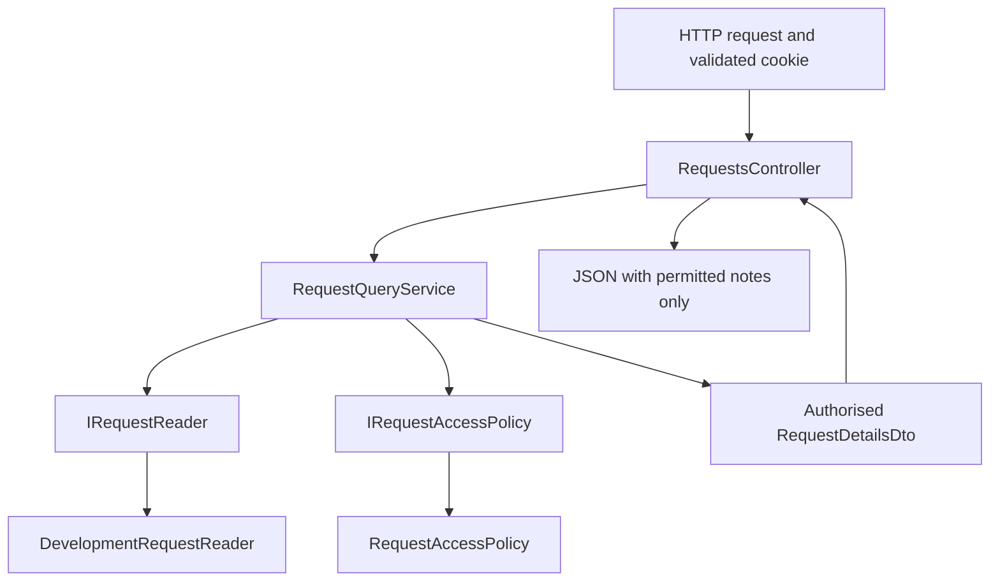
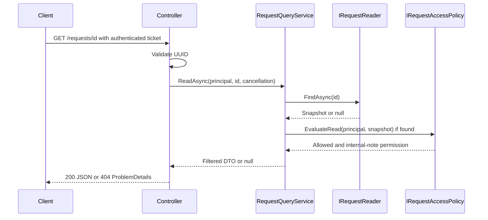

# Design and responsibility views

Solid nodes below identify the implemented read slice. PostgreSQL/EF Core and State are planned integrations described separately in the PED.

Authentication is not the resource decision. Permission is checked before a DTO leaves the service. Exceptions reach a generic 500 boundary. Future writes use a distinct application service: authorise action -> Bianca's transition service -> Michael's transactional store. They are not implemented by this diagram.
