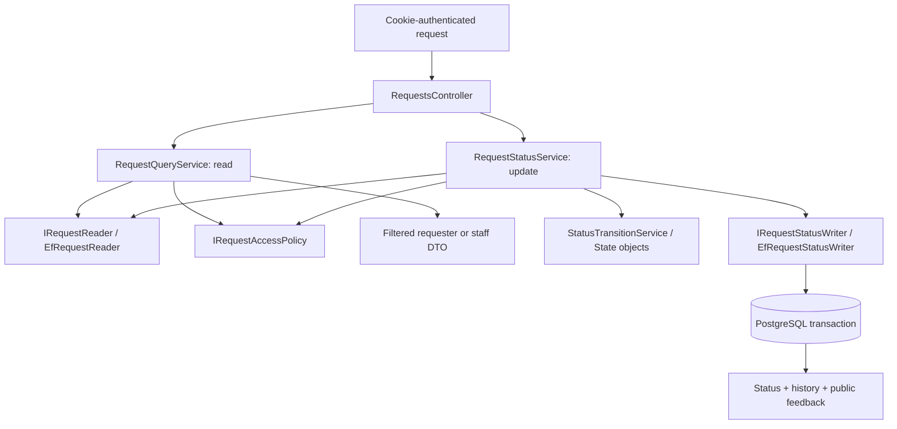
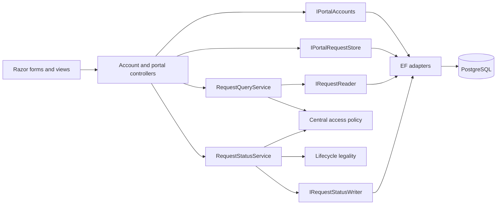

# M3 design and integration

The application remains one deployable unit with logical layers. Controllers handle HTTP and antiforgery; application services coordinate use cases; the access policy decides resource permissions; State objects decide transition legality; EF Core adapters own database operations.

```mermaid
flowchart TD
    HTTP[Cookie-authenticated request] --> C[RequestsController]
    C --> Q[RequestQueryService: read]
    Q --> R[IRequestReader / EfRequestReader]
    Q --> P[IRequestAccessPolicy]
    Q --> DTO[Filtered requester or staff DTO]
    C --> S[RequestStatusService: update]
    S --> R
    S --> P
    S --> T[StatusTransitionService / State objects]
    S --> W[IRequestStatusWriter / EfRequestStatusWriter]
    W --> DB[(PostgreSQL transaction)]
    DB --> H[Status + history + public feedback]
```

Read access does not grant write access. Only active, unambiguous Staff identities with the matching category can request status changes. Requesters see only their own records and public notes. Management reporting permission does not grant details or mutation permission.

The coordinator loads a snapshot, checks action permission, validates input and current status, asks the State service, then sends one command to the writer. The command includes the server-derived actor and observed version. The writer compares status/version and saves all three required effects atomically. A concurrent category or record change invalidates the checked version. Unexpected database failures reach the generic HTTP 500 boundary.

The State service was absent from supplied main. A small integration dependency was added using Bianca's approved lifecycle and test specifications; Michael remains its allocated implementation owner; both Michael and Bianca reviewed the combined increment on 14 October, followed by their PR17 approvals. The database writer remains a low-level persistence component, not an independently authorised public entry point.

## M4 final integration — 18 October 2026

The earlier diagrams retain their milestone context. The integrated Razor application now uses the following boundaries:

```mermaid
flowchart LR
    UI[Razor forms and views] --> C[Account and portal controllers]
    C --> A[IPortalAccounts]
    C --> P[IPortalRequestStore]
    C --> Q[RequestQueryService]
    C --> S[RequestStatusService]
    Q --> R[IRequestReader]
    Q --> X[Central access policy]
    S --> X
    S --> L[Lifecycle legality]
    S --> W[IRequestStatusWriter]
    A --> EF[EF adapters]
    P --> EF
    R --> EF
    W --> EF
    EF --> DB[(PostgreSQL)]
```

Assignment validates stored acting/owning accounts and saves ownership plus status/history/feedback in one transaction. Status writes recheck lifecycle legality and expected version. Notes are append-only through supported actions; scheduling changes have their own audit. Requester projections exclude private notes; staff queries apply category scoping before search and reporting. Physical layers still share one assembly, so privileged source-level EF access remains technical debt. See final persistent tests and the continued decision register for observed consequences.
